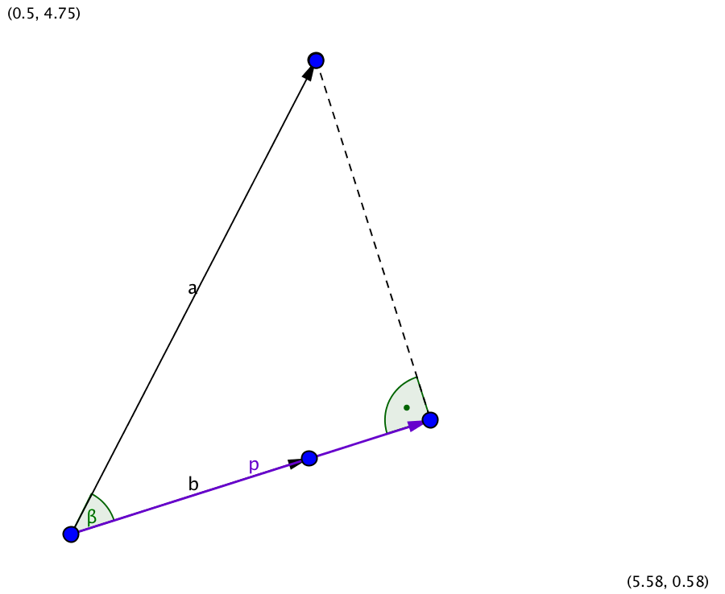
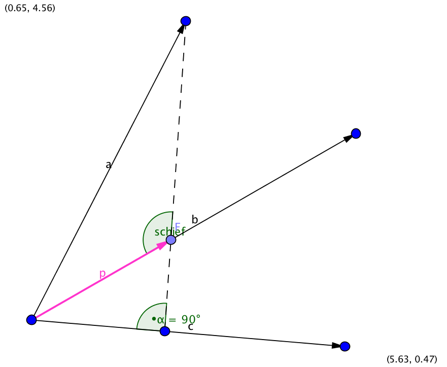
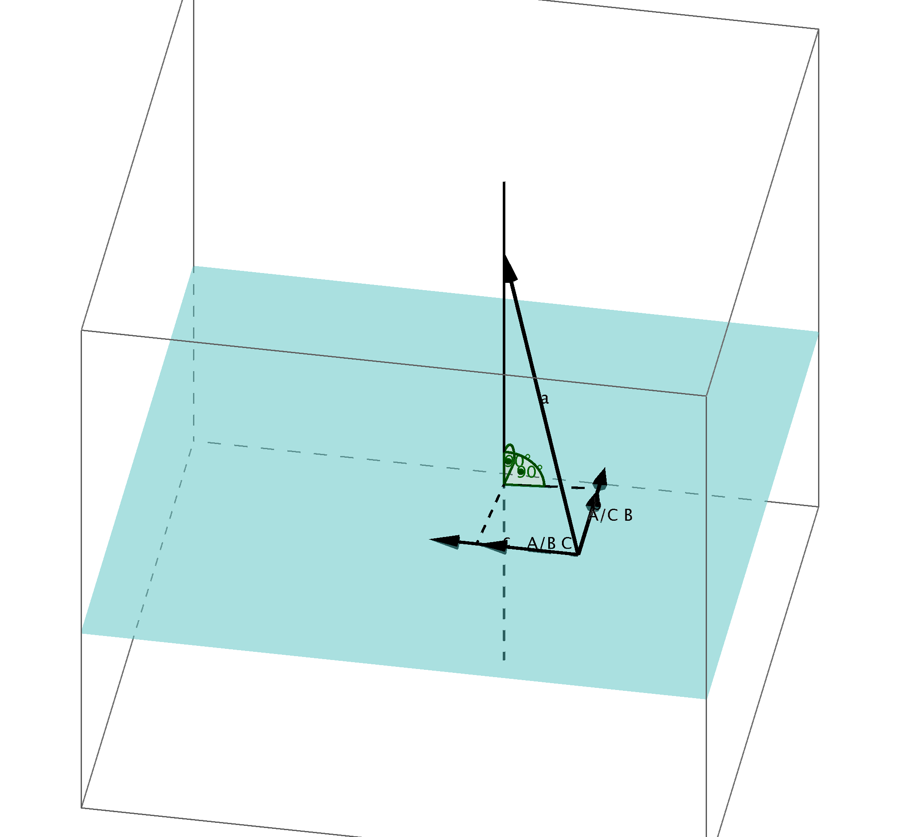

\newpage
#3. Subspace-based State-Space System Identification (4 SID)

Bisher:

- Identifikation von Differenzengleichungen/Übertragungsfunktionen
- aber: viele Methoden benötigen Zustandsraummodelle
- Problem: keine Infos über Zustand
- Vorteil: Schätzung von Zustandsdimension möglich

##3.1 Grundgleichungen, Zustandsraummodelle
Zustandsraummodell:

$$x[k+1] = A x[k] + B u[k]$$ - Folgezustand abhängig von aktuellem Zustand + Eingang

$$y[k] = C x[k] + D u[k]$$ - Ausgang abhängig von Zustand + Eingang

Bekannt: N Messdatenpaare u[k], y[k]

Problem: Weder Zustandsfolge x[k] noch Zustandsdimension n bekannt

$\begin{pmatrix}y[0]\\y[1]\\...\\y[k-1]\end{pmatrix} = \underbrace{\begin{pmatrix}C\\C A\\C A^2 \\...\\C A^{k-1}\end{pmatrix}}_{{\substack{Q_{B,k}\\\text{Beobachtbarkeitsmatrix} } }} x[0] +
\underbrace{\begin{pmatrix}
D & 0 & ... & 0 \\
C B & D & ... & 0 \\
.... & ... & D & 0 \\
C A^{k-2} B & C A^{k-3} B & CB & D
\end{pmatrix}}_{H_k} \begin{pmatrix}u[0]\\u[1]\\...\\u[k-1]\end{pmatrix}$

Zusammenfassung in Blockmatrizen:

$Y =  \begin{pmatrix}
y[0] & ... & y[N-2k] \\
\dots & ... & ... \\
y[k-1] & ... & y[N-k-1] \\
\hline 
y[k] & ... & y[N-k] \\
\dots & ... & ... \\
y[2k-1] & ... & y[N-1]
\end{pmatrix}
=  \begin{pmatrix}
Y_f  \\
\hline
Y_p
\end{pmatrix}$

Analog für:
$U = \begin{pmatrix}
U_f  \\
U_p
\end{pmatrix}$

### Subspace-Gleichungen
$Y_p = Q_{B,k} X_p + H_K U_p$

$Y_f = Q_{B,k} X_f + H_K U_f$

$X_f = A^k x_p + Q_{S,k} U_p$

mit $Q_{S,k} = \begin{pmatrix}A^{k-1} B  &   A^{k-2} B &       A B &  B\end{pmatrix}$ (erweiterte Steuerbarkeitsmatrix)

Durch Umformen/Einsetzten ergibt sich:

$X_f = \dots$ (nur abhängig von Vergangenheit)

$Y_f = Q_{B-k} L_{P,k} \begin{pmatrix}U_p \\ y_p\end{pmatrix} + H_k U_f$

=> Für nächsten Ausgang Wissen der zukünftigen Eingabe erforderlich

###3.2 Grundlagen: Projektion
###3.2.1 Orthogonale Projektion
\

Im zweidimensionalen lässt sich der Projektor $p$ folgendermaßen bestimmen: $p = a \cos{\alpha} \frac{|a|}{|b|} = a \frac{b^T b}{b b^T}$

###3.2.2 Schiefe Projektion

\

### Allgemeine schiefe Projektion
\

Vorgehen:

* Senkrechte Projektion in die von B und C aufgespannte Ebene
* Schiefe Projektion der Ebene

Definition: Allgemeine schiefe Projektion entlang des Orthogonalkomplements von C auf B:

$$ A/_C B := A \cdot \Pi $$

mit: $$ \Pi =
\begin{pmatrix}
B^T &  C^T
\end{pmatrix}
\begin{pmatrix}
B B^T & B C^T\\
C B^T & C C^T
\end{pmatrix}^+
\begin{pmatrix}
B\\
0
\end{pmatrix}$$

\newpage
## Ablaufschema 4SID
1) Messdaten u[i], y[i] aufnehmen, in Hankelmatrizen U, Y anordnen
2) Schiefen Prädiktor P berechnen
3) SVD von P
(Schätzung der Systemordnung (Länge Zustandsvektor); Schätzung für Beobachtbarkeitsmatrix $Q_{B,k}$)
4) Berechnen von A, C
5) Berechnen von B, D

## Bewertung der 4SID Methode

### Vorteile
- Auch für Mehrgrößensysteme geeignet (mehrere Ein- und Ausgänge)
- Zustandsraumdimension muss vorher nicht bekannt sein und wird ebenfalls geschätzt

### Nachteile
- liefert unter anderem einen verzerrten Schätzer (wie MkQ)